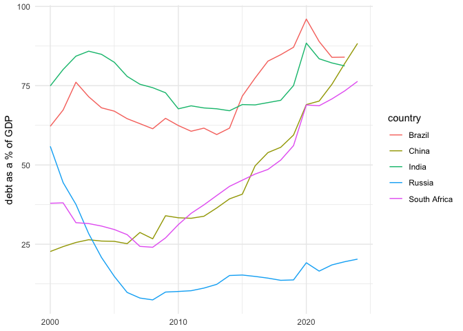
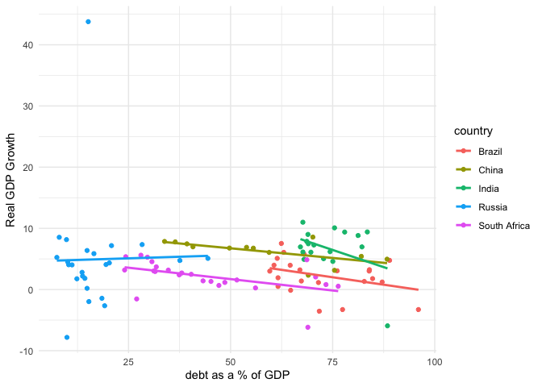

``` r
knitr::opts_chunk$set(message = FALSE)

rm(list = ls()) # Clean your environment:
gc() # garbage collection - It can be useful to call gc after a large object has been removed, as this may prompt R to return memory to the operating system.
```

    ##           used (Mb) gc trigger (Mb) limit (Mb) max used (Mb)
    ## Ncells  558034 29.9    1236560 66.1         NA   715645 38.3
    ## Vcells 1067757  8.2    8388608 64.0      16384  2010425 15.4

``` r
library(tidyverse)
library(fredr)
fredr_set_key("f287f35d692bc08c79b8d88c6ee3ba2d")
list.files('code/', full.names = T, recursive = T) %>% .[grepl('.R', .)] %>% as.list() %>% walk(~source(.))
library(fmxdat)
library(dplyr)
library(tidyr)
library(arrow)
library(readr)
library(janitor)
library(purrr)
library(pacman)
library(rmsfuns)
library(purrr)
library(broom)
library(fredr)
```

# Purpose

This tutorial will…

# Set-up

Data is obtained from FRED as follows:

``` r
library(fredr)
fredr_set_key("f287f35d692bc08c79b8d88c6ee3ba2d")

start_date <- as.Date("2000-01-01")

# First, Gross Government Debt as a % of GDP
debt_bra <- fredr(series_id = "GGGDTABRA188N", observation_start = start_date)
debt_rus <- fredr(series_id = "GGGDTARUA188N", observation_start = start_date)
debt_ind <- fredr(series_id = "GGGDTAINA188N", observation_start = start_date)
debt_chn <- fredr(series_id = "GGGDTACNA188N", observation_start = start_date)
debt_zaf <- fredr(series_id = "GGGDTAZAA188N", observation_start = start_date)

# Then, Real GDP 
gdp_bra <- fredr(series_id = "NGDPRXDCBRA", observation_start = start_date)
gdp_rus <- fredr(series_id = "NGDPRXDCRUA", observation_start = start_date)
gdp_ind <- fredr(series_id = "NGDPRXDCINA", observation_start = start_date)
gdp_chn <- fredr(series_id = "NGDPRXDCCNA", observation_start = start_date)
gdp_zaf <- fredr(series_id = "NGDPRXDCZAA", observation_start = start_date)
```

# Formatting

Combining data

``` r
# Combining the debt data for each country
debt_panel <- bind_rows(
  debt_bra |> mutate(country = "Brazil"),
  debt_rus |> mutate(country = "Russia"),
  debt_ind |> mutate(country = "India"),
  debt_chn |> mutate(country = "China"),
  debt_zaf |> mutate(country = "South Africa")
) |>
  select(country, date, value) |>
  rename(debt_gdp = value)

# Combining the gdp data for each country
gdp_panel <- bind_rows(
  gdp_bra |> mutate(country = "Brazil"),
  gdp_rus |> mutate(country = "Russia"),
  gdp_ind |> mutate(country = "India"),
  gdp_chn |> mutate(country = "China"),
  gdp_zaf |> mutate(country = "South Africa")
) |>
  select(country, date, value) |>
  rename(gdp = value)
```

Calculating GDP growth

``` r
gdp_growth_panel <- gdp_panel |> 
  group_by(country) |> 
  mutate(
    gdp_growth = (gdp/lag(gdp) - 1) * 100
  )|> 
  ungroup()
```

Merging all the data

``` r
brics <- debt_panel |>
  left_join(
    gdp_growth_panel, 
    by = c("country", "date")
  )
```

# Generating graphs

## General Government Gross Debt (% of GDP) for BRICS Countries

``` r
brics |> 
  ggplot(
    aes(x = date, y = debt_gdp, colour = country)
  ) +
  geom_line() +
  labs(
    x = NULL,
    y = "debt as a % of GDP"
  ) +
  theme_minimal()
```



## The Relationship Between Debt & GDP Growth

``` r
brics |> 
  ggplot(
    aes(x = debt_gdp, y = gdp_growth, colour = country)
  ) +
  geom_point() +
  geom_smooth(method = "lm", se = FALSE) +
  labs(
    x = "debt as a % of GDP",
    y = "Real GDP Growth"
  ) +
  theme_minimal()
```

    ## Warning: Removed 21 rows containing non-finite outside the scale range
    ## (`stat_smooth()`).

    ## Warning: Removed 21 rows containing missing values or values outside the scale range
    ## (`geom_point()`).


